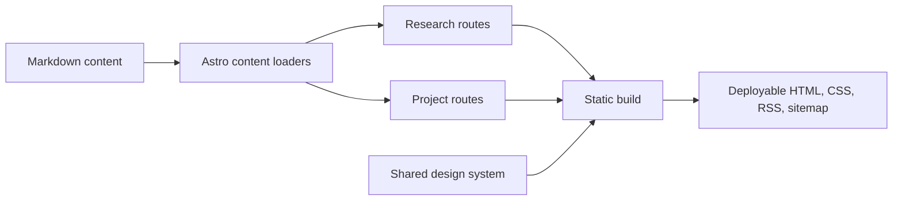

<div align="center">
  

  # Water

  **A quiet personal space for research, experiments, and tools about time, flow, and intelligent systems.**

  
  
  
</div>

## Why Water

Water is not a conventional developer portfolio. It is an editorial, Chinese-led personal world built around one idea:

> Research what moves. Build what remains.

The visual system connects three layers: an ancient-character-inspired identity gives the site memory, a blue river gives it motion, and sparse points give it a quiet sense of the future.

| Surface | Purpose | Content model |
| --- | --- | --- |
| Home | Identity, orientation, and recent work | Live research stream |
| Research | Essays, notes, experiments, and tags | Astro content collections |
| Projects | Structured product and system case studies | Project collection |
| About | Context, working method, and current interests | Static editorial page |

## Architecture



The site defaults to static output and ships only the JavaScript needed for the home-page atmosphere and code-copy controls.

## Run locally

Requirements: Node.js 22.12 or later.

```sh
npm install
npm run dev
```

Per the project convention, long-running development should use Astro's background mode:

```sh
npx astro dev --background
npx astro dev status
npx astro dev logs
npx astro dev stop
```

## Verify

```sh
npm test
```

The contract suite builds the production output, checks all published routes, confirms drafts stay private, and verifies release metadata such as canonical URLs, RSS, the sitemap, robots, and the custom 404 page.

## Production build

Set the public origin at build time:

```sh
SITE_URL=https://water.your-domain.tld npm run build
```

Without `SITE_URL`, local builds intentionally use `https://water.localhost`. This prevents the repository from claiming an unverified production domain while keeping canonical and feed generation deterministic.

The deployable site is written to `dist/`.

## Add content

Research entries live under:

```text
src/content/
├── essays/
├── notes/
├── experiments/
└── projects/
```

Set `draft: true` in frontmatter to keep an entry out of indexes, dynamic routes, RSS, and the sitemap.

## Design boundaries

- Chinese is the primary reading language; English is supporting metadata.
- Warm white, ink blue, river blue, sky blue, and a very small amount of sun yellow form the palette.
- The layout stays card-light and typography-led.
- Motion remains sparse and honors `prefers-reduced-motion`.
- The first release intentionally excludes accounts, comments, 3D scenes, and a custom admin system.

See [site-direction.md](./site-direction.md) for the original art direction and [docs/design-plan.md](./docs/design-plan.md) for the implementation phases.
