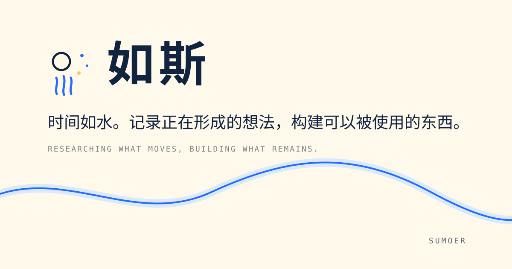
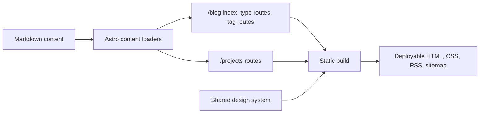

<div align="center">
  

  # Water

  **A quiet personal space for research, experiments, and tools about time, flow, and intelligent systems.**

  
  
  
</div>

## Why Water

Water is not a conventional developer portfolio. It is an editorial, Chinese-led personal world built around one idea:

> Research what moves. Build what remains.

The visual system connects three layers: an ancient-character-inspired identity gives the site memory, a blue river gives it motion, and sparse points give it a quiet sense of the future.

| Route | Purpose | Content model |
| --- | --- | --- |
| `/` | Identity, a painted river, a life timeline, and the latest writing | Two-screen editorial layout |
| `/blog` | Writing grouped by type, filterable by tag | Four Astro content collections |
| `/projects` | Structured product and system case studies | Project collection |
| `/about` | Context, working method, and current interests | Static editorial page |
| `/lab/river` | A parametric river built from curves, swept unions, and scroll-driven motion | Unlisted experiment (`noIndex`) |

Writing is organised by four types rather than by a flat blog feed:

| Collection | Label | Subject |
| --- | --- | --- |
| `harness` | 执行框架 / Harness | Agent execution frameworks and tool boundaries |
| `llm` | 模型 / LLM | Model behaviour, state, and memory |
| `eval` | 评估 / Eval | Evaluation design and its failure modes |
| `notes` | 笔记 / Notes | Shorter working notes |

## Architecture



The site defaults to static output and ships only the JavaScript needed for the home-page atmosphere, the river canvas, and code-copy controls. The river's geometry lives in `src/lib/riverMath.mjs` and is rendered by `src/lib/riverRenderer.mjs`, so the maths can be tested without a browser.

## Run locally

Requirements: Node.js 22.12 or later.

```sh
npm install
npm run dev
```

Per the project convention, long-running development should use Astro's background mode:

```sh
npx astro dev --background
npx astro dev status
npx astro dev logs
npx astro dev stop
```

## Verify

```sh
npm test
```

That runs the whole gate in order:

| Step | What it protects |
| --- | --- |
| `astro check` | Types across `.astro` and `.ts` sources |
| `test:contract` | Builds the production output, then checks every published route, confirms drafts stay private, and verifies canonical URLs, RSS, the sitemap, robots, and the custom 404 page |
| `test:river:math` | The river's geometry — bounded noise, symmetric banks, aspect correction, and a cusp limit that keeps sharp bends from folding — with no browser involved |
| `test:typewriter` | Line pacing driven by pixel width, so Chinese and English advance at the same speed |
| `test:timeline` | The life axis: evenly spaced years, milestones inside their own year, label thinning, and reveal timing |
| `test:links` | Every local href resolves inside `dist`, and every page keeps one primary heading and the shared landmarks |
| `test:mutation` | Injects deliberate faults into the build output and the river maths, then fails if the suites above do not catch them — the tests are themselves under test |

Individual steps run on their own, for example `npm run test:river:math`. The pure-logic suites — river maths, typewriter, timeline — need no build and stay fast enough to run on every edit. The contract, link, and mutation steps read `dist/`, so run them after a build.

## Production build

Set the public origin at build time:

```sh
SITE_URL=https://water.your-domain.tld npm run build
```

Without `SITE_URL`, local builds intentionally use `https://water.localhost`. This prevents the repository from claiming an unverified production domain while keeping canonical and feed generation deterministic.

The deployable site is written to `dist/`.

## Add content

Entries are Markdown files under `src/content/`, one directory per collection:

```text
src/content/
├── harness/    # 执行框架
├── llm/        # 模型
├── eval/       # 评估
├── notes/      # 笔记
└── projects/
```

The four writing collections share one schema — `title`, `description`, `pubDate`, `tags`, `draft`. Projects carry structured metadata instead: `title`, `tagline`, `status`, `type`, `built`, plus optional `demo`, `repo`, `cover`, and `featured`. Schemas are defined in [src/content.config.ts](./src/content.config.ts).

Set `draft: true` in frontmatter to keep an entry out of indexes, dynamic routes, RSS, and the sitemap. The contract suite asserts this, so a draft that leaks into the build fails the tests.

## Design boundaries

- Chinese is the primary reading language; English is supporting metadata.
- Warm white, ink blue, river blue, sky blue, and a very small amount of sun yellow form the palette.
- The layout stays card-light and typography-led.
- Motion remains sparse and honors `prefers-reduced-motion`.
- The first release intentionally excludes accounts, comments, 3D scenes, and a custom admin system.

See [site-direction.md](./site-direction.md) for the original art direction and [docs/design-plan.md](./docs/design-plan.md) for the implementation phases.
