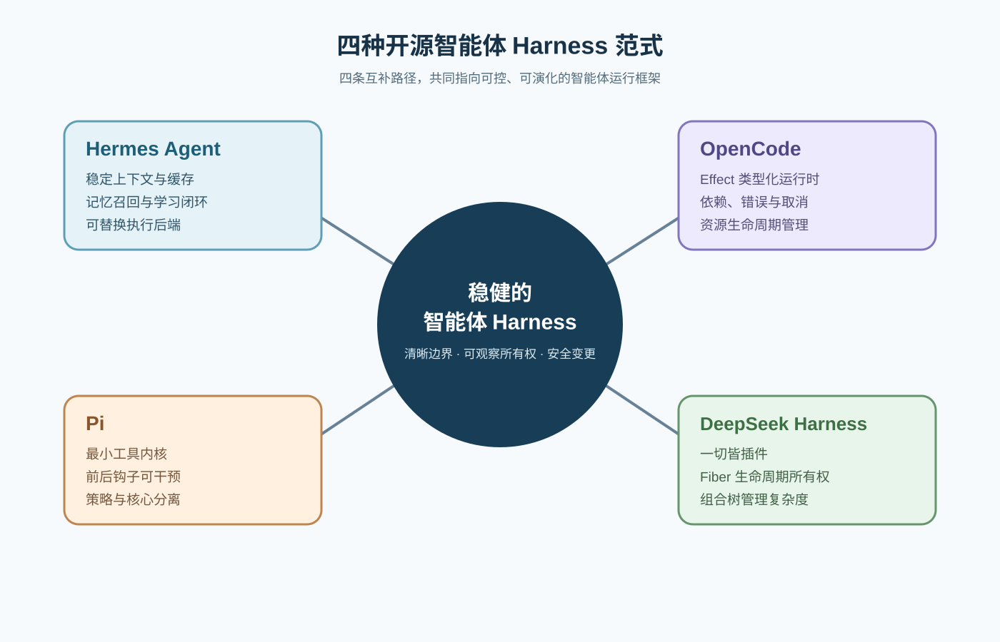
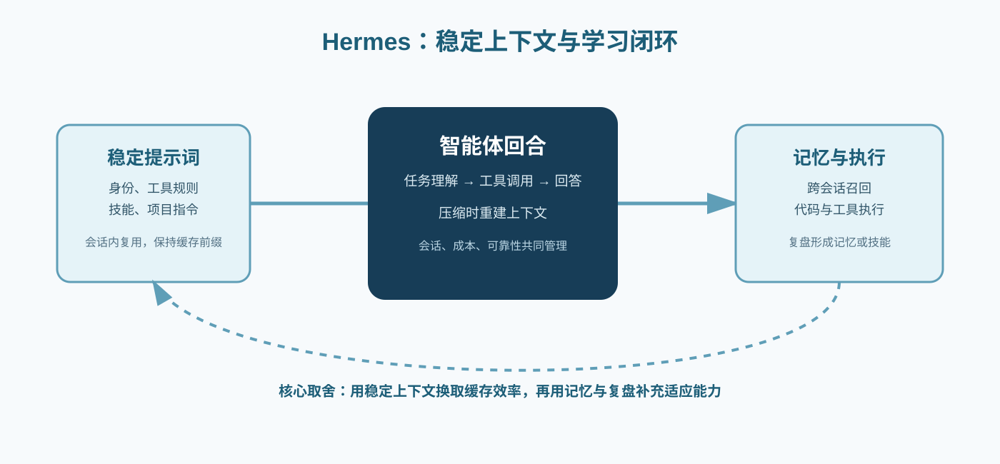
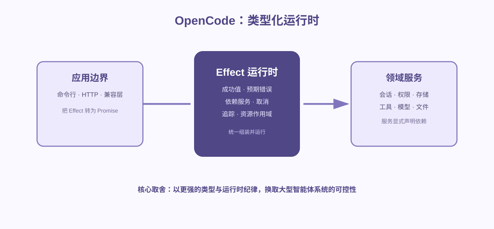
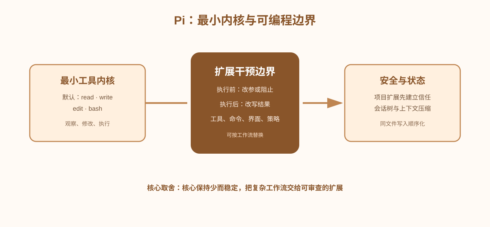
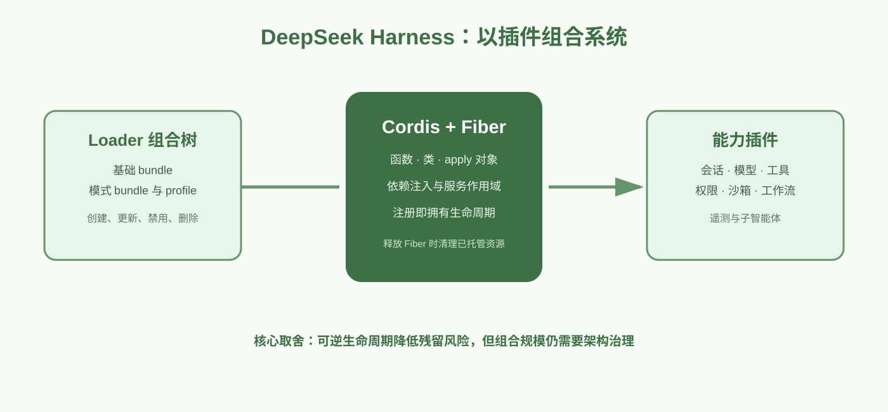

> 图文精简版：用一张总览图与四张项目图，快速理解四种不同的智能体运行框架思路。

| 项目 | 主语言 | 核心库／运行时 | 核心模块 |
| --- | --- | --- | --- |
| Hermes Agent | Python | 自身智能体运行时、记忆与执行后端 | 系统提示词、记忆、代码执行 |
| OpenCode | TypeScript | Effect | 应用运行时、工具注册表、会话处理 |
| Pi | TypeScript | Pi Agent Core 与扩展系统 | 基础工具、扩展钩子、会话树 |
| DeepSeek Harness | TypeScript | Cordis | Loader、Fiber、服务与工具插件 |

## Hermes：稳定上下文与学习闭环

Hermes 的主线是让高频上下文保持稳定，以提高提示词缓存复用；记忆负责跨会话连续性，后台复盘和技能沉淀负责学习闭环。执行后端可以替换，但本地终端不等同于强隔离沙箱。

## OpenCode：类型化运行时

OpenCode 用 Effect 将成功值、可预期错误、服务依赖、取消与资源生命周期放入同一模型。它仍处在 v1 与 v2 的渐进迁移中，工具注册表是理解这套运行时的最佳入口。

## Pi：最小内核与可编程边界

Pi 只向模型默认开放少量基础工具，把子智能体、计划模式、权限、远程执行等策略交给扩展。工具调用前后都可介入，因此适合实现阻止、改参、脱敏和结果裁剪等工作流。

## DeepSeek Harness：以插件组合系统

DeepSeek Harness 通过 Cordis 将会话、模型、工具、沙箱、权限和工作流等能力组合为插件。Fiber 提供生命周期所有权：已纳入作用域的服务、监听器和副作用可随插件卸载而清理；未托管的全局副作用仍需额外治理。

## 一句话结论

四者分别强调上下文连续性、运行时正确性、策略灵活性和系统组合能力。一个稳健的 Harness 不取决于功能数量，而取决于是否拥有清晰边界、可观察所有权与安全的变更路径。
